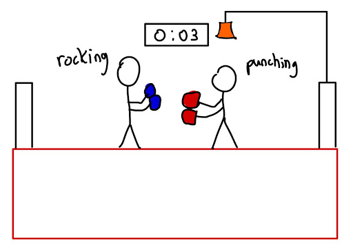
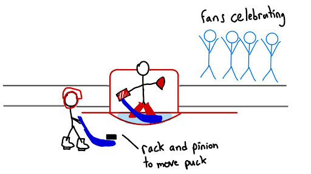
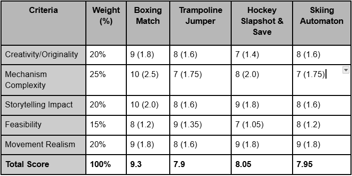
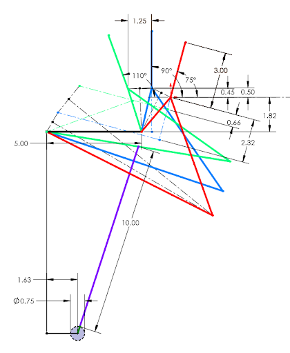
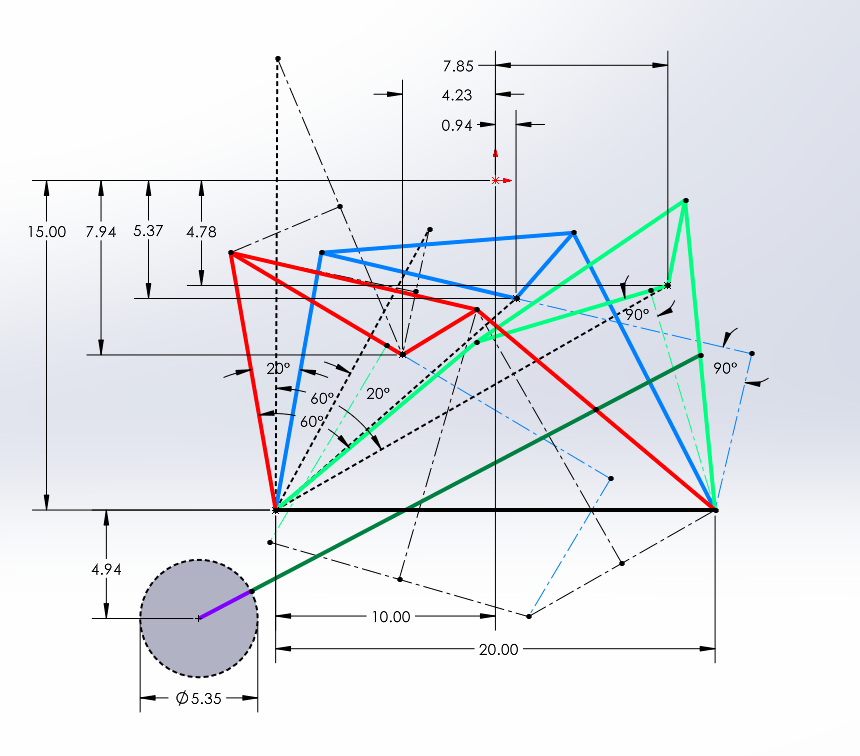

# Boxing Animation

This project was part of my mechanisms class, where were I was tasked with creating an automated sport simulation powered by a single hand crank, utilizing mechanisms such as four-bar linkages, Geneva wheels, cams, and slider-cranks.

## Skills Applied
- Mechanism synthesis
- Motion design
- CAD modeling (SolidWorks)

## Project Overview

### Design Selection
- Brainstormed several potential sports-themed automaton ideas:
 
- Evaluated designs using a weighted objective chart:

- The boxing animation scored highest (9.3/10) and was chosen.
- The build was modeled at a 1:10 scale.

### Mechanism Breakdown

Each movement in the automaton was achieved with a unique mechanism:

1. **Dodge**
   - Modeled with a four-bar linkage (3 precision points + 1 dyad).
   - Synthesis via graphical and analytical motion generation methods. See graphical synthesis below:
   
   - Motion:

2. **Kick**
   - Designed with a four-bar linkage using path generation with prescribed timing.
   - Kick accelerates during extension phase (timing emphasized in synthesis).
   - Graphical synthesis: 
   - Motion:

3. **Punch**
   - Replicated with a slider-crank mechanism.
   - Dyad calculated from max/min shoulder angles.
   - Motion:

4. **Bell**
   - Simulated using a cam and follower system.
   - Cam profile shaped to ring bell once per full cycle.

5. **Clock**
   - Created with a Geneva wheel.
   - Each full crank rotation advances the clock by 1 second.
   - Mechanism counts down from 5 to 0.

### Synchronization and Gearing
- Mechanisms are synchronized via gear trains:
  - Dodge, Kick, and Bell: 1:1 gear ratio.
  - Punch: 2:1 (punches twice per full cycle).
  - Clock: 6:1 (ticks every 1/6 rotation).
- Gear layout designed to maintain timing and realism.
   

### Ring and Boxer Modeling
- Boxing ring modeled after Olympic standards (scaled to 1:10).
- Boxers were CAD-modeled with joints and degrees of freedom that match each motion.

### Final Result

[Click here to watch the animation](https://www.youtube.com/embed/uiw-7N4O6TU)

<iframe width="315" height="560" src="https://www.youtube.com/embed/uiw-7N4O6TU?autoplay=0&playsinline=1" frameborder="0" allowfullscreen></iframe>

---
    
 
