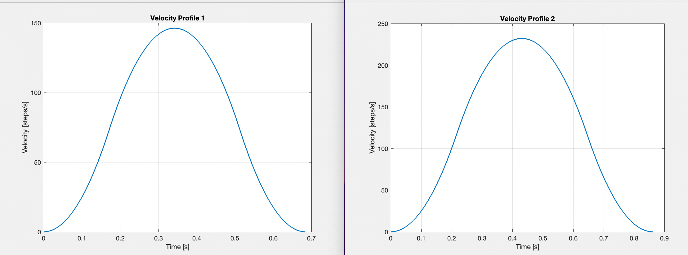

# Conveyor Sorter

This project was part of the mechatronics class, it utilized an ATmega2560 and L298N motor driver to sort objects by material using optical and reflective sensors.

## 🚀 Skills Applied
- Embedded C programming
- Stepper motor control
- S-curve motion profile modeling
- System troubleshooting
- In depth MCU understanding

## Sorting System in Action

<video width="560" height="315" controls autoplay>
  <source src="sort.mp4" type="video/mp4">
  Your browser does not support the video tag.
</video>

<!--## S-Curve Motion Code
[Click to view S-Curve Motion Code](stepper_acceleration.m)-->

## Optimized Velocity Profile

