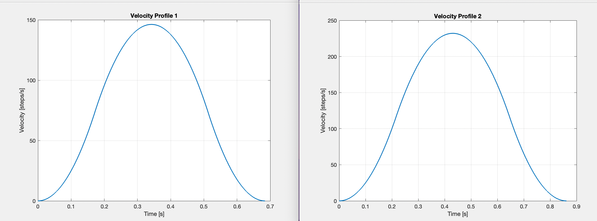

# Conveyor Sorter

This project was part of the mechatronics class, it utilized an ATmega2560 and L298N motor driver to sort objects by material using optical and reflective sensors.

## Skills Applied
- Embedded C programming
- Stepper motor control
- S-curve motion profile modeling
- System troubleshooting
- In depth MCU understanding

## Sorting System in Action

<iframe 
  width="560" 
  height="315" 
  src="https://www.youtube.com/embed/hqMgv_qh0ds?autoplay=0&playsinline=1" 
  frameborder="0" 
  allowfullscreen>
</iframe>

<!--## S-Curve Motion Code
[Click to view S-Curve Motion Code](stepper_acceleration.m)-->

## Optimized Velocity Profile of Stepper

