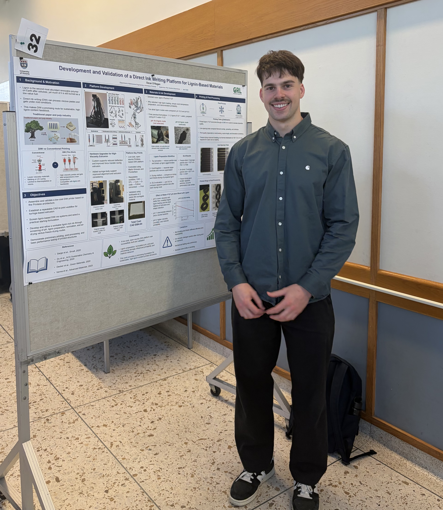

# Lignin-Based Direct Ink Writing Thesis

**Honours thesis project on direct ink writing of lignin-based materials, supervised by Prof. Samira Gharehkhani at the University of Victoria.**

This project focused on developing a low-cost direct ink writing platform and using it to explore printable lignin-based formulations for sustainable materials applications.

At the **2026 UVic CAMTEC Annual Symposium**, this work was presented as a poster and received **second place overall among the posters presented**.

Project files:
- [View thesis report](./thesis.pdf)
- [View poster](./poster.pdf)

---

## Poster Presentation

---

## Quick Summary

- Built and validated a low-cost open-source direct ink writing printer
- Developed a workable lignin-based ink route for preliminary printing
- Demonstrated printing, freeze-drying, and thermal stabilization of samples
- Presented the work at CAMTEC and received second place overall among the posters presented
